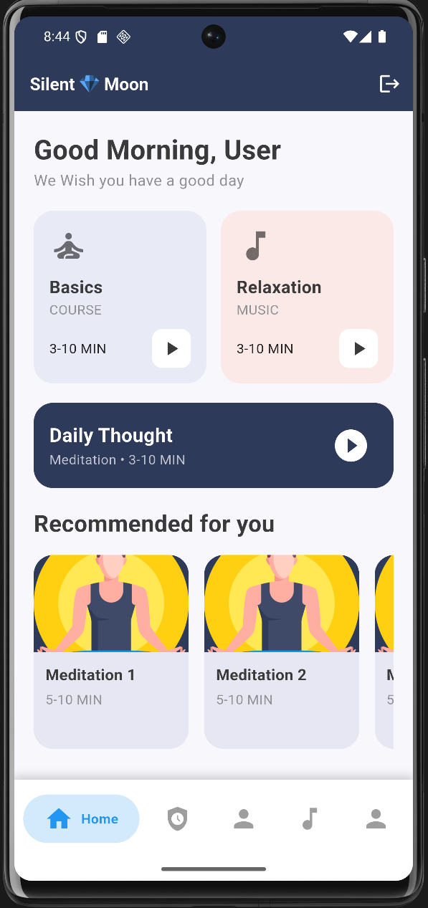
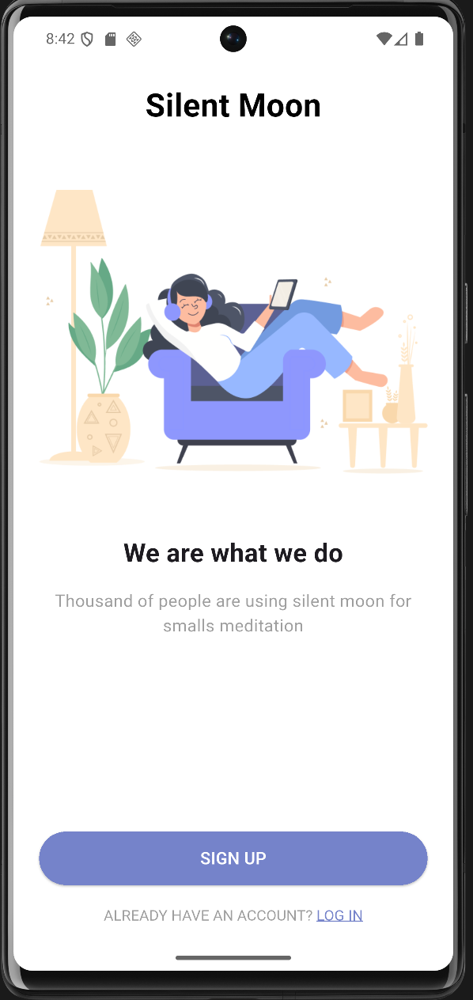
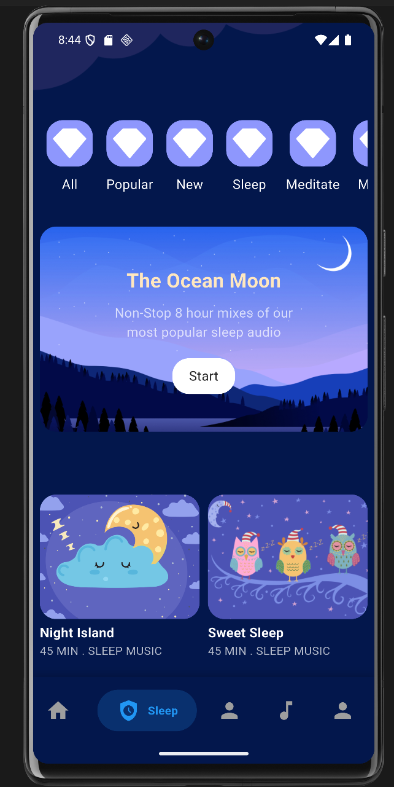
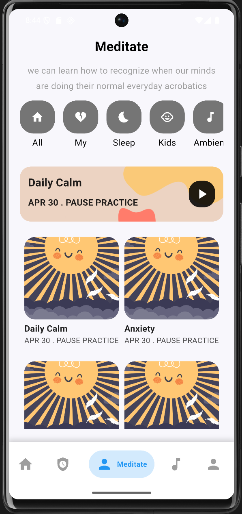
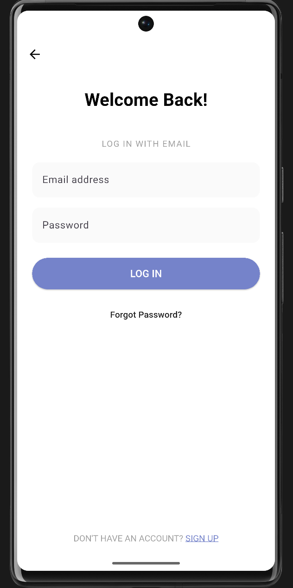
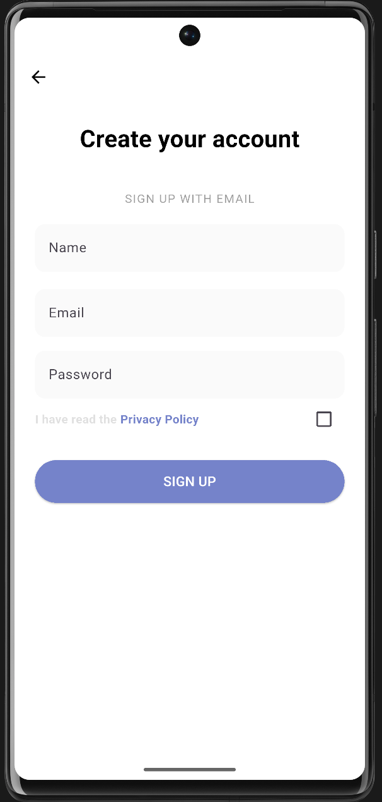

# 🧘‍♀️ Meditation App – Flutter UI


---

## 📖 Introduction

**Meditation App** est une application mobile développée en **Flutter**, inspirée du design [Meditation App UI (Community)](https://www.figma.com/design/BNucXL99Y5fWG7mYW07kCk/Meditation-app-UI--Community-?node-id=0-1&t=cWR874XrHgPWq5wH-1).  
Le but principal du projet était de **reproduire une interface moderne, fluide**.

🌿 Initialement, une connexion via **Supabase** était intégrée pour la gestion des utilisateurs, mais elle a été retirée après la fermeture du service.  
Le projet reste donc **frontend uniquement**, focalisé sur la partie **UI/UX et l’architecture Flutter propre**.

---

## 🌟 Fonctionnalités (UI)

- 🧘 **Écran principal** : affichage des séances de méditation avec visuels.  
- 😴 **Section “Sleep”** : interface relaxante avec sons et visuels apaisants.  
- 💫 **Onboarding** : illustration animée au premier lancement.  
- 🔄 **Navigation fluide** via la bottom bar.  

---

## 🎥 Démonstration visuelle

Découvrez un aperçu du design de **Meditation App Flutter**  

### 🏠 Accueil & Onboarding
<p align="center">
  
  
</p>

---

### 🌙 Section Sommeil & Méditation
<p align="center">
  
  
</p>

---

### 🔐 Authentification (UI uniquement)
<p align="center">
  
  
</p>

---

## 🛠️ Technologies utilisées

- **Framework** : Flutter `3.5.3+`  
- **Langage** : Dart  
- **Architecture** : MVVM + BLoC  
- **UI Design** : Reproduction Figma *(Meditation App UI – Community)*  
- **State Management** : `flutter_bloc`  
- **Navigation** : `persistent_bottom_nav_bar`  

### 📦 Packages utilisés

| Package | Description |
|----------|-------------|
| `flutter_bloc` | Gestion d’état réactive (BLoC) |
| `carousel_slider` | Carrousels d’images et d’écrans |
| `shared_preferences` | Sauvegarde locale des préférences |
| `flutter_staggered_grid_view` | Grilles et layouts dynamiques |
| `supabase_flutter` | (Désactivé) ancienne auth backend |
| `freezed`, `json_serializable` | Génération de modèles immuables |
| `cupertino_icons` | Icônes iOS par défaut |

---

## ⚙️ Installation

### 🧩 Prérequis

- Flutter SDK `3.5.3+`  
- Android Studio ou VS Code  
- Un appareil ou émulateur pour tester l’application  

### 🚀 Étapes

```bash
# Cloner le projet
git clone https://github.com/votre-username/meditation_app.git

# Aller dans le dossier
cd meditation_app

# Installer les dépendances
flutter pub get

# Lancer l’application
flutter run

```

---

## 🏗️ Architecture du projet

```
MeditationApp/
├── lib/
│   ├── core/
│   │   ├── constants/               # Couleurs, polices, tailles, etc.
│   │   └── widgets/                 # Widgets communs et réutilisables
│   ├── features/
│   │   ├── auth/                    # (Ancien module Supabase, désactivé)
│   │   │   ├── data/
│   │   │   ├── domain/
│   │   │   └── presentation/
│   │   ├── home/                    # Page d'accueil
│   │   │   └── presentation/
│   │   │       ├── pages/
│   │   │       └── widget/
│   │   ├── meditation/              # Page principale de méditation
│   │   │   └── presentation/
│   │   │       └── meditation_page.dart
│   │   ├── profile/                 # Profil utilisateur
│   │   │   └── presentation/
│   │   │       └── profile_page.dart
│   │   └── sleep/                   # Section sommeil
│   │       └── presentation/
│   │           ├── widget/
│   │           └── pages/
│   └── main.dart                    # Point d’entrée principal
├── images/                          # Images & illustrations UI
├── test/                           
├── web/ | macos/ | windows/ | linux/
└── README.md
```
---

## 🗂️ Description des dossiers

- **core/** → contient les constantes globales, styles, couleurs, et widgets réutilisables.
- **features/** → chaque fonctionnalité (auth, home, sleep, meditation, profile) est isolée pour une meilleure maintenabilité.
- **presentation/** → couche interface utilisateur (écrans, widgets, blocs).
- **images/** → contient toutes les illustrations et ressources visuelles.
- **test/** → dossiers de tests unitaires (optionnels).

---

## Contact  

Si vous souhaitez en savoir plus sur ce projet ou discuter de développement Flutter, n’hésitez pas à me contacter :  

**kurkluserhat@gmail.com**   
[GitHub – Serhat6863](https://github.com/Serhat6863)  

---

✨ Développé avec **Flutter**  
© 2025 – Serhat KÜRKLÜ

